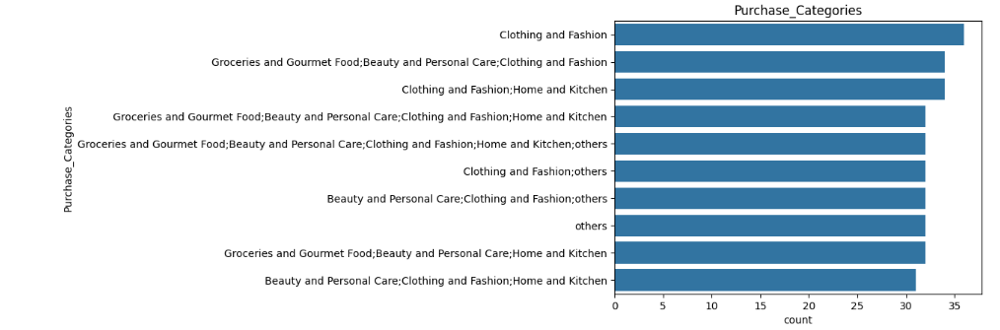
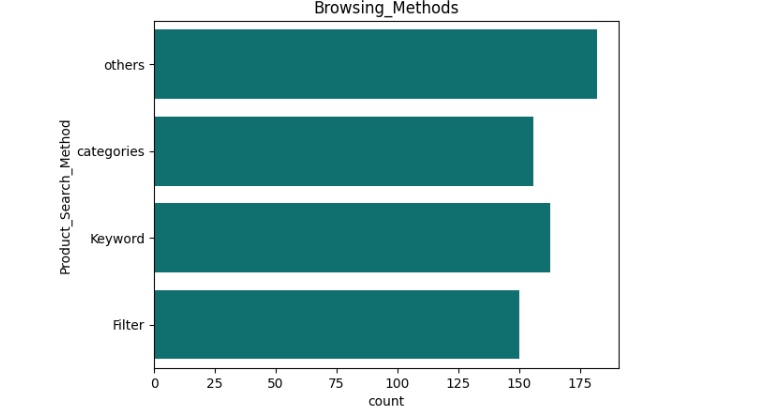
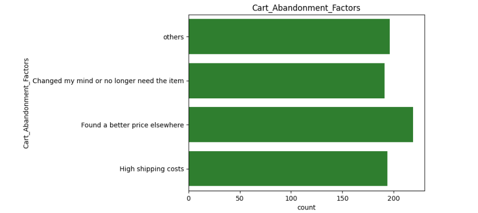
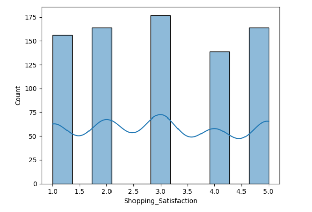
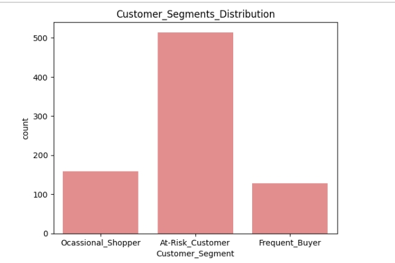
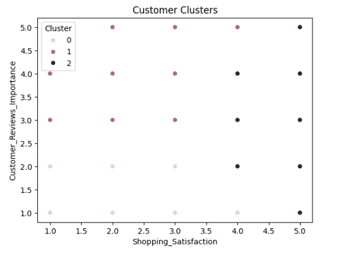
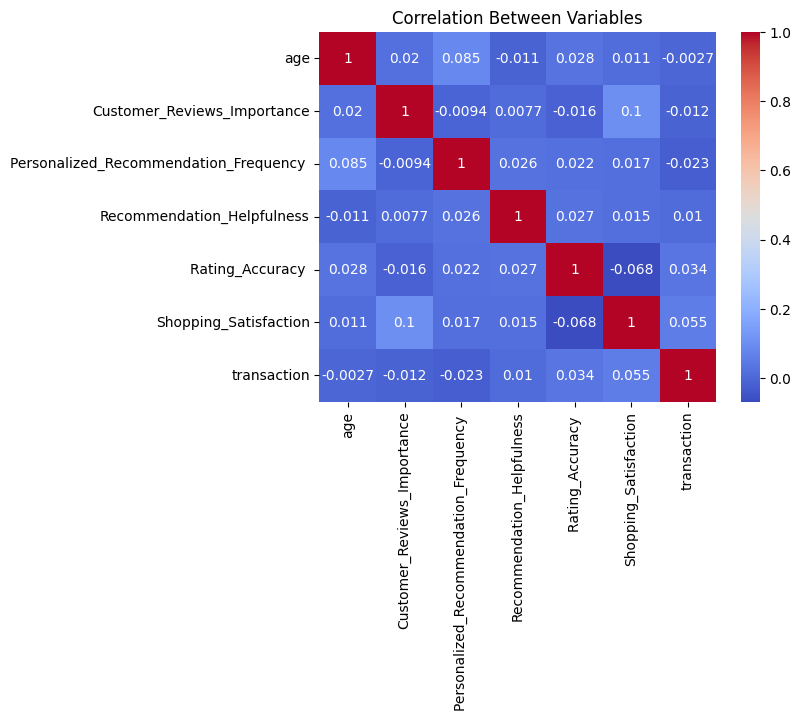

# Snapdeal-market-basket-analysis-ML
# 🛒 Market Basket Analysis & Customer Insights (Snapdeal)

## 📌 Overview
This project analyzes customer purchasing behavior on Snapdeal to uncover product associations, customer segments, and recommendation insights using Python.

## 🎯 Problem Statement
E-commerce platforms like Snapdeal need to understand:
- Products frequently bought together (cross-selling opportunities)
- Customer purchasing patterns across demographics
- Customer segmentation for personalized marketing
- Factors driving customer loyalty and repeat purchases

## ⚙️ Tools & Technologies
- Python  
- Pandas  
- NumPy  
- Matplotlib / Seaborn  
- Scikit-learn (K-Means Clustering)  
- MLxtend (Association Rule Mining)

## 🧹 Data Cleaning & Preparation
- Removed duplicate and inconsistent records  
- Standardized categorical values (gender, frequency, etc.)  
- Handled missing values  
- Converted rating columns into numeric format  
- Cleaned column names  

## 📊 Descriptive Analysis
- Analyzed customer demographics (age, gender)  
- Identified most popular product categories  
- Studied purchase frequency patterns  
- Evaluated customer satisfaction and recommendation behavior  

## 👥 Customer Segmentation

### Segments Created:
On basis of
** Customer_Review_Importance
&
** Shopping_Satisfaction

### Technique Used:
- K-Means Clustering  

## 🔗 Market Basket Analysis(Snapdeal)

- Applied Association Rule Mining  
- Identified frequently purchased product combinations  
- Generated rules using support, confidence, and lift  

👉 Example Insight:
- Customers buying Product A also tend to buy Product B

---

## 💡 Recommendation Insights
- Strong correlation between recommendation helpfulness and satisfaction  
- Reliable reviews improve purchase decisions  
- Personalized recommendations increase engagement
 
## 📈 Visual Insights

### 🛍️ Purchase Category Distribution

### 🌐 Browsing Method Analysis

### 🛒 Cart Abandonment Factors

### 📊 Shopping Satisfaction

## 🤖 Machine Learning Insights

### 🔥 Customer Segmentation

### 📍 Cluster Formation

## 📊 Correlation Analysis

### 📉 Feature Correlation Heatmap

## 📁 Files Included
- Customer_Segmentation_analysis.ipynb → Python notebook
- Behavior_Analysis.ipynb → Python notebook 
- Data_cleaning.ipynb → Python notebook 
- visuals → Charts and graphs  
- Visualization and Reporting.ipynb → Python notebook 

## 🎯 Key Insights
- Identified high-demand product combinations  
- Segmented customers for targeted marketing  
- Highlighted factors influencing customer satisfaction  
- Provided actionable recommendations for business growth  

## 🚀 Business Recommendations
- Implement personalized product recommendations  
- Optimize inventory based on product associations  
- Target at-risk customers with offers  
- Improve review reliability and recommendation system  

## 🙌 Author

Shruti Sahu
